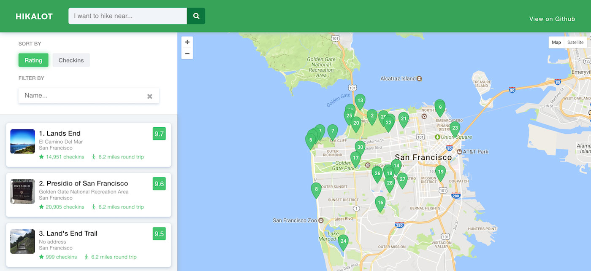

Hikalot
===============================
[Hikalot](https://github.com/jonwonglam/udacity-hikalot) is a web app project built for the [Udacity Front-End Nanodegree](https://www.udacity.com/course/front-end-web-developer-nanodegree--nd001) course. It allows you to search for hiking trails and parks and view their ratings and trail length.



# Quickstart
Checkout the latest version on [Gthub Pages](https://jonwonglam.github.io/udacity-hikalot/).

### Building the app
Requirements: [Node.js](https://nodejs.org/en/) must be installed for the npm package manager.

1. Clone or download the repo.
2. Navigate to the repo.
    ```bash
    $> cd your_folder/udacity-hikalot
    ```
3. Run `npm install` to get all the required dependencies.
4. Run `gulp` to start the build tools.
5. Open `dist/index.html`.

# About Hikalot
Hikalot was created for the "Neighborhood Map" Udacity project.
It is powered by the Google Maps, Yelp, and Foursquare APIs. It also uses the required Knockout.js framework as a MVVC organization structure.

### Background
Udacity's project requirements were to develop a single-page application of a neighborhood using the Google Map API along with 3rd-party APIs. The app had to display map markers and have a list view, along with a way to filter the list.


*Udacity's example: "Bart Locations in San Francisco"*

### Development Process

Being a one-man team, I was the project-lead, designer, and developer all in one. By no means is this process the *best* way to do things, but it was a logical one for me and helped save development time.

**High Level Brainstorm**

I've learned that it pays to plan ahead and figure out what your app will look like instead of blindly coding away and figuring things out on the go. The first thing I did was to make a high-level summary of what the app will do and create a quick sketch of the layout:
* Look up popular hiking trails in your area
* Able to sort by rating, popularity, distance
* Combines ratings from both Yelp and Foursquare

**Requirements and Specifications**

The next thing was to flesh out the details and features of the app. My process consisted of making a detailed list of a component and how it incorperated features. For example the sidebar details looked like this:
* Sidebar
    * Search by location input box
    * Filter by
        * Rating
        * Number of reviews
        * Distance to location
        * Trail Length
    * Search Results
        * Name
        * Address
        * Trail image
        * Rating
        * Trail Length
        * View more details

After detailing all the components, I would run through a loosely created use-case and see if there were any features or functionality missing. Then I would go back and refine the details more. (In retrospect, for a more formal team-based project, I would probably flesh out exactly what these requirements and functionality would look like: limitations and certain cases).

**Design**

After getting the details done, I moved on to turning the requirements into a layout. Photoshop was the tool I primarily used to create the mockup, but I also learned that you save a lot of time by getting most of the layout done on paper. It took me about a third of the time to figure out the layout via sketching compared to figuring it out in Photoshop. Once the layout was done on paper, it was pretty straightforward to make it look good in Photoshop.

**Coding**

This is where I am at now, but the basic plan I'm following is to:

1. Create a basic HTML layout with CSS
2. Incorperate Google Maps API
3. Setup inputs, tied to Knockout.js
4. Basic Results with dummy data
5. Incorperate Yelp and Foursquare APIs
